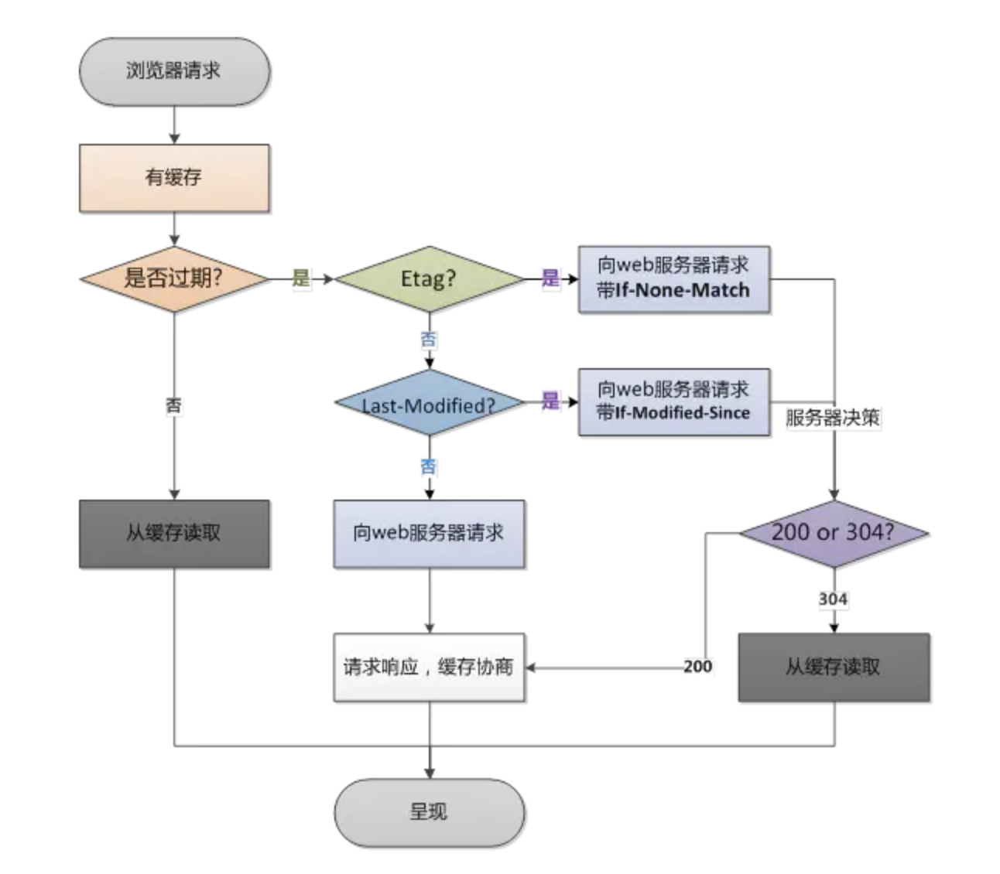

# 状态码

1. 301 永久重定向
2. 302 临时重定向
3. 304 对客户端有缓存情况下服务端的一种响应
a.浏览器请求资源时首先命中资源的Expires 和 Cache-Control，Expires 受限于本地时间，如果修改了本地时间，可能会造成缓存失效，可以通过Cache-control: max-age指定最大生命周期，状态仍然返回200，但不会请求数据，在浏览器中能明显看到from cache字样
b.强缓存失效，进入协商缓存阶段，首先验证ETagETag可以保证每一个资源是唯一的，资源变化都会导致ETag变化。服务器根据客户端上送的If-None-Match值来判断是否命中缓存。
c.协商缓存Last-Modify/If-Modify-Since阶段，客户端第一次请求资源时，服务服返回的header中会加上Last-Modify，Last-modify是一个时间标识该资源的最后修改时间。再次请求该资源时，request的请求头中会包含If-Modify-Since，该值为缓存之前返回的Last-Modify。服务器收到If-Modify-Since后，根据资源的最后修改时间判断是否命中缓存。

## Expires

缓存过期时间，用来指定资源到期的时间，是服务器端的具体的时间点。也就是说，Expires=max-age + 请求时间，需要和Last-modified结合使用。Expires是Web服务器响应消息头字段，在响应http请求时告诉浏览器在过期时间前浏览器可以直接从浏览器缓存取数据，而无需再次请求。

Expires 是 HTTP/1 的产物，受限于本地时间，如果修改了本地时间，可能会造成缓存失效。Expires:Wed,22Oct201808:41:00GMT表示资源会在 Wed, 22 Oct 2018 08:41:00 GMT 后过期，需要再次请求。

## Cache-Control

在HTTP/1.1中，Cache-Control是最重要的规则，主要用于控制网页缓存。比如当 Cache-Control:max-age=300时，则代表在这个请求正确返回时间（浏览器也会记录下来）的5分钟内再次加载资源，就会命中强缓存。

Cache-Control 可以在请求头或者响应头中设置，并且可以组合使用多种指令：

图片

public：所有内容都将被缓存（客户端和代理服务器都可缓存）。具体来说响应可被任何中间节点缓存，如 Browser <-- proxy1 <-- proxy2 <-- Server，中间的proxy可以缓存资源，比如下次再请求同一资源proxy1直接把自己缓存的东西给 Browser 而不再向proxy2要。

private：所有内容只有客户端可以缓存，Cache-Control的默认取值。具体来说，表示中间节点不允许缓存，对于Browser <-- proxy1 <-- proxy2 <-- Server，proxy 会老老实实把Server 返回的数据发送给proxy1,自己不缓存任何数据。当下次Browser再次请求时proxy会做好请求转发而不是自作主张给自己缓存的数据。

no-cache：客户端缓存内容，是否使用缓存则需要经过协商缓存来验证决定。表示不使用 Cache-Control的缓存控制方式做前置验证，而是使用 Etag 或者Last-Modified字段来控制缓存。需要注意的是，no-cache这个名字有一点误导。设置了no-cache之后，并不是说浏览器就不再缓存数据，只是浏览器在使用缓存数据时，需要先确认一下数据是否还跟服务器保持一致。

no-store：所有内容都不会被缓存，即不使用强制缓存，也不使用协商缓存

max-age：max-age=xxx (xxx is numeric)表示缓存内容将在xxx秒后失效

s-maxage（单位为s)：同max-age作用一样，只在代理服务器中生效（比如CDN缓存）。比如当s-maxage=60时，在这60秒中，即使更新了CDN的内容，浏览器也不会进行请求。max-age用于普通缓存，而s-maxage用于代理缓存。s-maxage的优先级高于max-age。如果存在s-maxage，则会覆盖掉max-age和Expires header。

max-stale：能容忍的最大过期时间。max-stale指令标示了客户端愿意接收一个已经过期了的响应。如果指定了max-stale的值，则最大容忍时间为对应的秒数。如果没有指定，那么说明浏览器愿意接收任何age的响应（age表示响应由源站生成或确认的时间与当前时间的差值）。

min-fresh：能够容忍的最小新鲜度。min-fresh标示了客户端不愿意接受新鲜度不多于当前的age加上min-fresh设定的时间之和的响应。图片

从图中我们可以看到，我们可以将多个指令配合起来一起使用，达到多个目的。比如说我们希望资源能被缓存下来，并且是客户端和代理服务器都能缓存，还能设置缓存失效时间等等。
在HTTP/1.1中，Cache-Control是最重要的规则，主要用于控制网页缓存。比如当 Cache-Control:max-age=300时，则代表在这个请求正确返回时间（浏览器也会记录下来）的5分钟内再次加载资源，就会命中强缓存。

Cache-Control 可以在请求头或者响应头中设置，并且可以组合使用多种指令：

图片

public：所有内容都将被缓存（客户端和代理服务器都可缓存）。具体来说响应可被任何中间节点缓存，如 Browser <-- proxy1 <-- proxy2 <-- Server，中间的proxy可以缓存资源，比如下次再请求同一资源proxy1直接把自己缓存的东西给 Browser 而不再向proxy2要。

private：所有内容只有客户端可以缓存，Cache-Control的默认取值。具体来说，表示中间节点不允许缓存，对于Browser <-- proxy1 <-- proxy2 <-- Server，proxy 会老老实实把Server 返回的数据发送给proxy1,自己不缓存任何数据。当下次Browser再次请求时proxy会做好请求转发而不是自作主张给自己缓存的数据。

no-cache：客户端缓存内容，是否使用缓存则需要经过协商缓存来验证决定。表示不使用 Cache-Control的缓存控制方式做前置验证，而是使用 Etag 或者Last-Modified字段来控制缓存。需要注意的是，no-cache这个名字有一点误导。设置了no-cache之后，并不是说浏览器就不再缓存数据，只是浏览器在使用缓存数据时，需要先确认一下数据是否还跟服务器保持一致。

no-store：所有内容都不会被缓存，即不使用强制缓存，也不使用协商缓存

max-age：max-age=xxx (xxx is numeric)表示缓存内容将在xxx秒后失效

s-maxage（单位为s)：同max-age作用一样，只在代理服务器中生效（比如CDN缓存）。比如当s-maxage=60时，在这60秒中，即使更新了CDN的内容，浏览器也不会进行请求。max-age用于普通缓存，而s-maxage用于代理缓存。s-maxage的优先级高于max-age。如果存在s-maxage，则会覆盖掉max-age和Expires header。

max-stale：能容忍的最大过期时间。max-stale指令标示了客户端愿意接收一个已经过期了的响应。如果指定了max-stale的值，则最大容忍时间为对应的秒数。如果没有指定，那么说明浏览器愿意接收任何age的响应（age表示响应由源站生成或确认的时间与当前时间的差值）。

min-fresh：能够容忍的最小新鲜度。min-fresh标示了客户端不愿意接受新鲜度不多于当前的age加上min-fresh设定的时间之和的响应。图片

从图中我们可以看到，我们可以将多个指令配合起来一起使用，达到多个目的。比如说我们希望资源能被缓存下来，并且是客户端和代理服务器都能缓存，还能设置缓存失效时间等等。
